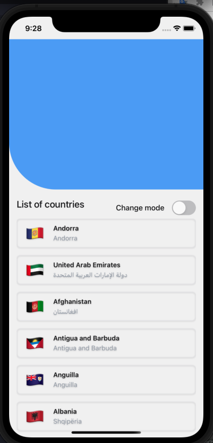
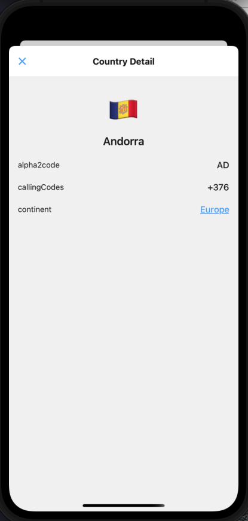
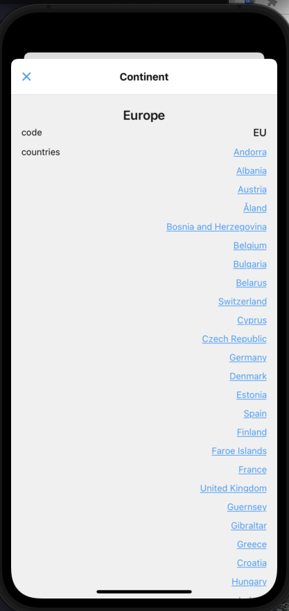
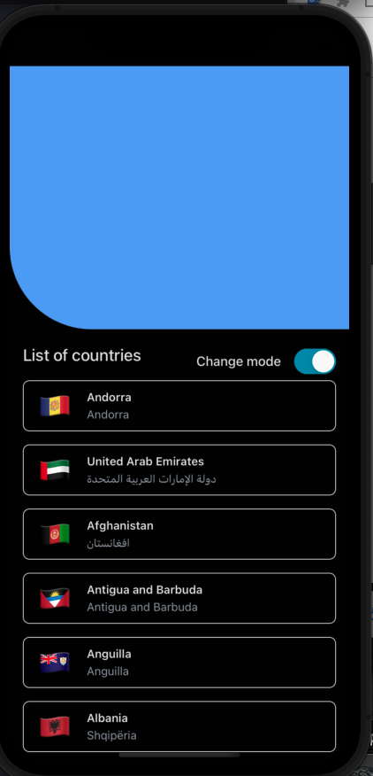
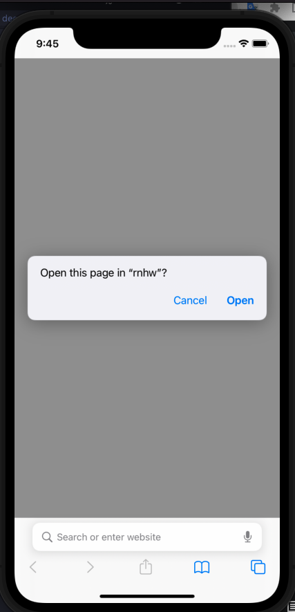

# Folder Directories
- src
  - components: contains UI can be reused
  - constant: contains variables not be changed
  - containers: contains main UI for each screen
  - navigators: contains types and Stack Screens for App
  - services: contains functions to call API (using Apollo)

# Main Function
  - Home Screen

  - Country Screen

  - Continent Screen

  - Dark Mode Screen

  - Deeplink Screen
  - 

